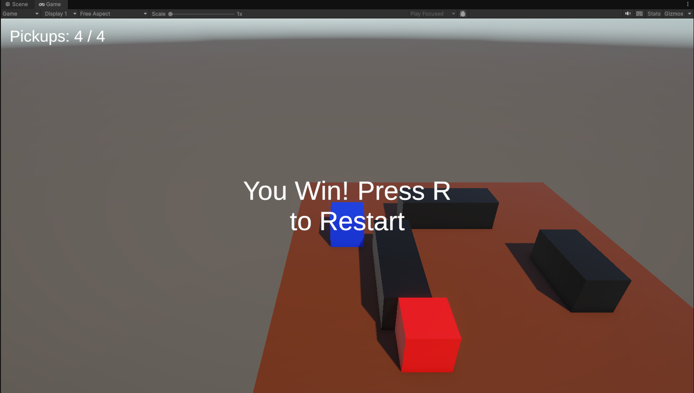

# CollectAndSurvive-Unity

A Unity gameplay programming prototype focused on movement, pickups, UI, enemy patrol behavior, and level flow.

The player must collect all pickups while avoiding obstacles and a patrolling enemy. If the enemy catches the player, the level restarts after a short delay. Once all pickups are collected, the player wins and can restart the level by pressing `R`.

## Features

- Player movement using `Rigidbody`
- Camera follow system
- Pickup collection system
- UI pickup counter
- Win condition with on-screen message
- Level restart on victory
- Patrolling enemy
- Enemy collision that restarts the level
- Basic obstacle layout
- Organized scene hierarchy and reusable prefabs

## Built With

- Unity 6
- C#
- TextMeshPro

## Project Structure

- `Assets/Scenes` - Main scene for the prototype
- `Assets/Scripts` - Gameplay and system scripts
- `Assets/Prefabs` - Reusable game objects
- `Assets/Materials` - Materials for player, enemy, pickups, obstacles, and ground
- `Assets/UI` - UI-related assets

## Scripts Overview

- `PlayerMover` - Handles player movement using `Rigidbody`
- `CameraFollow` - Makes the camera follow the player
- `PickupCollector` - Detects and counts collected pickups
- `PickupUI` - Updates the pickup counter and win text
- `EnemyPatrol` - Moves the enemy between patrol points
- `EnemyCollision` - Detects player contact with the enemy
- `LevelManager` - Handles restart flow and win-state behavior

## Gameplay Rules

- Collect all pickups to win
- Avoid the enemy
- If the enemy touches the player, the level restarts
- Press `R` after winning to restart the level

## Learning Goals

This project was built as part of a Unity programming learning path focused on:

- Understanding Unity's component-based architecture
- Working with `MonoBehaviour`, `Update`, and `FixedUpdate`
- Using `Rigidbody` correctly for movement
- Detecting triggers and collisions
- Separating gameplay logic from UI logic
- Organizing a small Unity project for portfolio presentation

## Screenshots

Add screenshots here, for example:

## Future Improvements

- Add sound effects
- Add visual feedback on enemy hit
- Add more enemy types or movement patterns
- Expand the level layout
- Add a start menu and game over screen

## Author

Jason Chavarría Alvarado